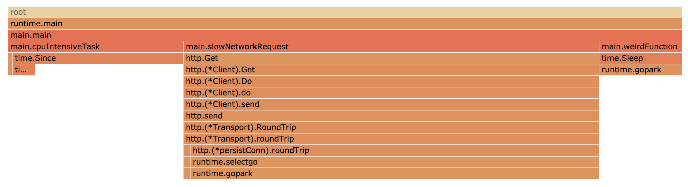
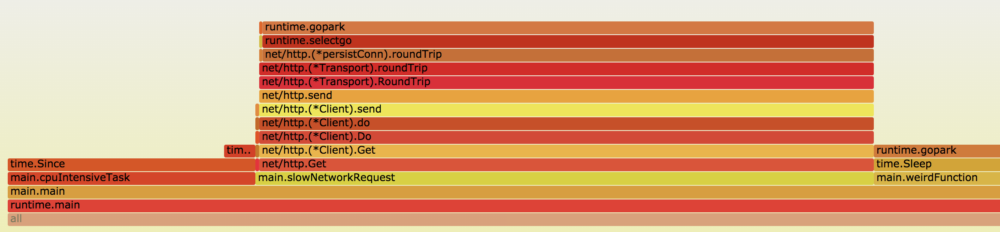

# fgprof - The Full Go Profiler

fgprof is a sampling [Go](https://golang.org/) profiler that allows you to analyze On-CPU as well as [Off-CPU](http://www.brendangregg.com/offcpuanalysis.html) (e.g. I/O) time together.

Go's builtin sampling CPU profiler can only show On-CPU time, but it's very good at that. Go also supports tracing profiling that can analyze I/O, but it can't be combined with the CPU profiler.

fgprof is designed for analyzing applications with mixed I/O and CPU workloads.

## Quick Start

If this is the first time you hear about fgprof, you should start by reading
about [The Problem](#the-problem).

There is no need to choose between fgprof and the builtin profiler. Here is how to add both to your application:

```
package main

import(
	_ "net/http/pprof"
	"github.com/felixge/fgprof"
)

func main() {
	http.DefaultServeMux.Handle("/debug/fgprof", fgprof.Handler())
	go func() {
		log.Println(http.ListenAndServe("localhost:6060", nil))
	}()

	// <your code>
}
```

fgprof is compatible with the `go tool pprof` visualizer, so taking and analyzing a 3s profile is as simple as:

```
go tool pprof --http=:6061 http://localhost:6060/debug/fgprof?seconds=3
```



Additionally fgprof supports the plain text format used by Brendan Gregg's [FlameGraph](http://www.brendangregg.com/flamegraphs.html) utility:

```
git clone https://github.com/brendangregg/FlameGraph
cd FlameGraph
curl -s 'localhost:6060/debug/fgprof?seconds=3' > fgprof.fold
./flamegraph.pl fgprof.fold > fgprof.svg
```



Which tool you prefer is up to you, but one thing I like about Gregg's tool is that you can filter the plaintext files using grep which can be very useful when analyzing large programs.

If you don't have a program to profile right now, you can `go run ./example` which should allow you to reproduce the graphs you see above.

## The Problem

Let's say you've been tasked to optimize a simple program that has a loop calling out to three functions:

```go
func main() {
	for {
		// Http request to a web service that might be slow.
		slowNetworkRequest()
		// Some heavy CPU computation.
		cpuIntensiveTask()
		// Poorly named function that you don't understand yet.
		weirdFunction()
	}
}
```

One way to decide which of these three functions you should focus your attention on would be to wrap each function call like this:

```go
start := time.Start()
slowNetworkRequest()
fmt.Printf("slowNetworkRequest: %s\n", time.Since(start))
// ...
```

However, this can be very tedious for large programs. You'll also have to figure out how to average the numbers in case they fluctuate. And once you've done that, you'll have to repeat the process for the functions called by the function you decide to focus on.

### /debug/pprof/profile

So, this seems like a perfect use case for a profiler. Let's try the builtin pprof profiler:

```go
import _ "net/http/pprof"

func main() {
	go func() {
		log.Println(http.ListenAndServe("localhost:6060", nil))
	}()

	// code to profile ...
}
```

```
go tool pprof -http=:6070 http://localhost:6060/debug/pprof/profile?seconds=10
```

That was easy! Looks like we're spending all our time in `cpuIntensiveTask()`, so let's focus on that?


Maybe, but let's quickly double check this assumption by manually timing our function calls with `time.Since()` as described above and looking at the results:

```
slowNetworkRequest: 66.815041ms
cpuIntensiveTask: 30.000672ms
weirdFunction: 10.64764ms
slowNetworkRequest: 67.194516ms
cpuIntensiveTask: 30.000912ms
weirdFunction: 10.105371ms
// ...
```

So what's going on? Well, as it turns out, `/debug/pprof/profile` is a pure CPU profiler, i.e. it only shows the time our code is spending on the CPU. Time spent waiting on I/O is completely hidden from us.

### /debug/pprof/trace

Let's try something else. The `/debug/pprof/trace` endpoint includes a "synchronization blocking profile" profile, maybe that's what we need?

```
curl -so pprof.trace http://localhost:6060/debug/pprof/trace?seconds=10
go tool trace --pprof=sync pprof.trace > sync.pprof
go tool pprof --http=:6062 sync.pprof
```

Ok, so all our time is spent on `slowNetworkRequest()`? That doesn't make sense, we already know that this is not true. I'm not entirely sure, but I think this profile only shows the time our code is blocked on channel operations.


### fgprof

So what can we do? Let's try fgprof. Adding it as as easy as `net/http/pprof`, but it requires Brendan Gregg's [FlameGraph tool](https://github.com/brendangregg/FlameGraph) for visualization.

```go
import "github.com/felixge/fgprof"

func main() {
	go func() {
		log.Println(http.ListenAndServe("localhost:6060", fgprof.Handler()))
	}()

	// code to profile ..
}
```

```
git clone https://github.com/brendangregg/FlameGraph
cd FlameGrap
curl -s localhost:6060/?seconds=10 > fgprof.fold
./flamegraph.pl fgprof.fold > fgprof.svg
```

Finally, a profile that shows all three of our functions and how much time we're spending on them. It also turns out our `weirdFunction()` was simply calling `time.Sleep()`, how weird indeed!


## How it Works

fgprof is implemented as a background goroutine the wakes up 99 times per second and calls `runtime.GoroutineProfile`. This returns a list of all goroutines regardless of their current On/Off CPU scheduling status and their call stacks.

This data is used to maintain an in-memory stack counter which gets converted to an output format understood by Brendan Gregg's [FlameGraph tool](https://github.com/brendangregg/FlameGraph) at the end of the profiling session.

Hardcore Go/Systems developers might rightfully point out that real profilers [use signals](https://jvns.ca/blog/2017/12/17/how-do-ruby---python-profilers-work-/), and I agree. If time allows, I'd love to make fgprof more robust or even contribute an improved version to the Go project itself.

However, for the time being, fgprof is hopefully going to be more useful than the current tooling when it comes to debugging I/O + CPU intense programs.

## Known Issues

- Internal runtime functions are not showing up in the stack traces, e.g.
  `runtime.nanotime` which is called by `time.Since` in the example program.
- The profile of the example program might have relative errors up to 5%. But
  it's not clear yet if this is a problem with the profiler or the example
  program itself.
- The current implementation is relying on the Go scheduler to schedule the
  internal goroutine at a fixed sample rate. Scheduler delays, especially
  biased ones, might cause inaccuracies. A better solution would probably be to
  use a signal handler like Go's builtin CPU profiler, but it's not clear if
  this can be done from userland.
