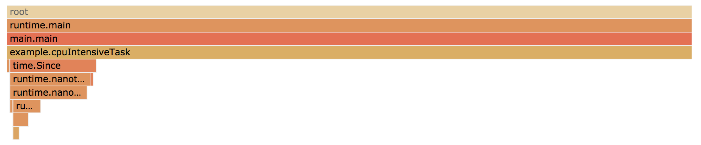

# gprof

gprof is an experimental goroutine profiler that allows users to analyze function time spent On-CPU as well as [Off-CPU](http://www.brendangregg.com/offcpuanalysis.html) (e.g. waiting for I/O) together.

As far as I know, this kind of analysis is currently not possible with the builtin Go tools, but I'd be happy to be proven wrong about it. I'd also love to get general feedback about this kind of profiling.

## The Problem

Let's say you've been tasked to optimize a simple program that has a loop calling out to three functions:

```go
func main() {
	for {
		// Http request to a web service that might be slow.
		slowNetworkRequest()
		// Some heavy CPU computation.
		cpuIntensiveTask()
		// Poorly named function that you don't understand yet.
		weirdFunction()
	}
}
```

One way to decide which of these three functions you should focus your attention on would be to wrap each function call like this:

```go
start := time.Start()
slowNetworkRequest()
log.Printf("slowNetworkRequest: %s\n", time.Since(start))
// ...
```

However, this can be very tedious for large programs. You'll also have to figure out how to average the numbers in case they fluctuate. And once you've done that, you'll have to repeat the process for the functions called by the function you decide to focus on.

So, this seems like a perfect use case for a profiler. Let's try the builtin
pprof profiler:

```go
import _ "net/http/pprof"

func main() {
	go func() {
		log.Println(http.ListenAndServe("localhost:6060", nil))
	}()

	for {
		// ...
	}
}
```

```
go tool pprof -http=:6070 http://localhost:6060/debug/pprof/profile?seconds=10
```

That was easy! Looks like we're spending all our time in `cpuIntensiveTask()`,
so let's focus on that?



## Known Issues

- Internal runtime functions are not showing up in the stack traces, e.g.
  `runtime.nanotime` which is called by `time.Since` in the example program.
- The profile of the example program might have relative errors up to 5%. But
  it's not clear yet if this is a problem with the profiler or the example
  program itself.
- The current implementation is relying on the Go scheduler to schedule the
  internal goroutine at a fixed sample rate. Scheduler delays, especially
  biased ones, might cause inaccuracies. A better solution would probably be to
  use a signal handler like Go's builtin CPU profiler, but it's not clear if
  this can be done from userland.
